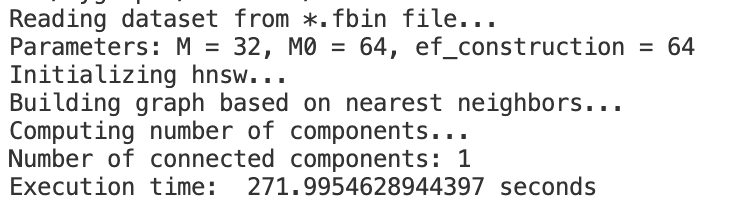
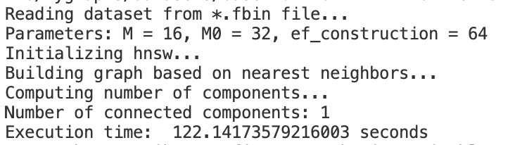

# Navigable Graphs Python
Python based research tool for studying navigable graphs for nearest neighbour search

Using the SIFT dataset:
```
python navigable-graphs.py --dataset sift
```

Using synthetic data with 3D vectors:
```
python navigable-graphs.py --dataset synthetic --K 20 --k 5 --dim 3 --n 500 --nq 100 --ef 20 --M 2
```

In this repository, program for components number check is implemented. Results when running on 10m subset of yandex-deep1B dataset are presented below.

```
python navigable-graphs.py --dataset path/to/file/base.10M.fbin --ef 64 --M 32
```
result


```
python navigable-graphs.py --dataset path/to/file/base.10M.fbin --ef 64 --M 16
```
result
